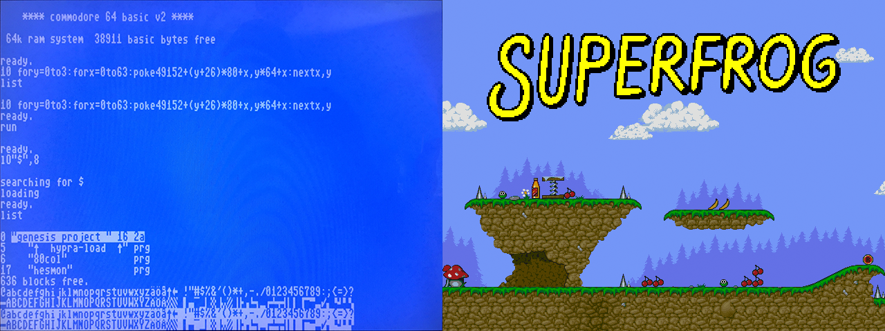
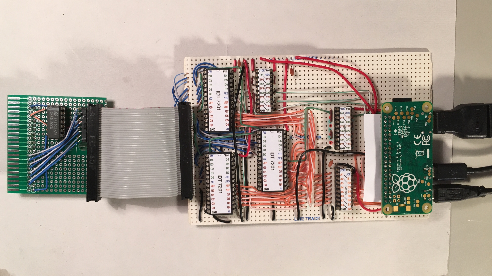

FIFOgfx
=======

### An open source graphics card targeted at 8/16-bit computers.

This repository <s>contains</s> will contain schematics, drivers, and demo programs for my graphics card project. It aims to fill the void between classic graphics chips, which are hard to integrate in modern systems, and modern FPGA based solutions and GPUs that require complex, proprietary development tools. The card can be built entirely with through hole components and the total bill of materials is less than $50. The focus is on *fun* graphics so it supports 60 fps scrolling, sprites, and raster effects, but of course it also handles regular text modes.

## Architecture

The graphics card interfaces with the host computer by snooping the system bus for memory writes, which are mirrored into a Raspberry Pi via a FIFO buffer board. The card is transparent to the host computer, and is programmed via display lists in the host's memory. Using a microcontroller to build a display adapter is by no means a new idea, but they tend to be limited in what they can do by the strict timing requirements, as neither the host bus nor the video generator tolerate any latency. My main contribution is the FIFO buffer board that relaxes the timing requirement and allows a dirt cheap Raspberry Pi zero running Linux to act as a relatively powerful graphics card with HDMI out.

                .-----------.   .------------.   .---------.
    Computer => | Interface |=>=| FIFO board |=>=| Pi Zero | => HDMI
                `-----------'   `------------'   `---------'

### Host Interface

The host interface provides the system's address and data bus, as well as the write and reset signals. For the rev1 and rev2 prototypes I've built a C64 cartridge that connects to the FIFO board via a 40-pin ribbon cable (IDE).

### FIFO board

The board uses IDT 7201 buffer chips to store writes on the host system's memory bus, and generates an irq when there is data available for the Pi. The board has a 40-pin connector for the host interface, and another 40-pin connector for Raspberry Pi GPIO.

### Raspberry Pi

For the Pi I've built a kernel driver that uses GPIO to read from the 7201 FIFOs into a memory buffer, effectively mirroring the host computer's RAM. The buffer is then rendered using a display core to the Pi console.

## Display Core

The current display core implements the following:

* 320x240, 640x240, 320x480, or 640x480 pixel display, with 16 colors from a 16-bit r5g6b5 palette.
* Bitmap mode and tiled mode. Tiles can be 8x8, 8x16, 16x8, or 16x16 pixels.
* Monochrome, attribute (bg/fg), 4-color, and 16-color modes.
* Smooth scrolling.
* Flexible display address and modulo.
* 8 sprites, 64x32 pixels (mono), 32x32 pixels (attr/4-color), 16x32 pixels (16-color).
* Display list processor, with WAIT and MOVE commands. Line based raster effects are supported.

## Live Debugger

A side effect of the memory mirror is that the Pi can be used for live inspection of the host's memory. 
